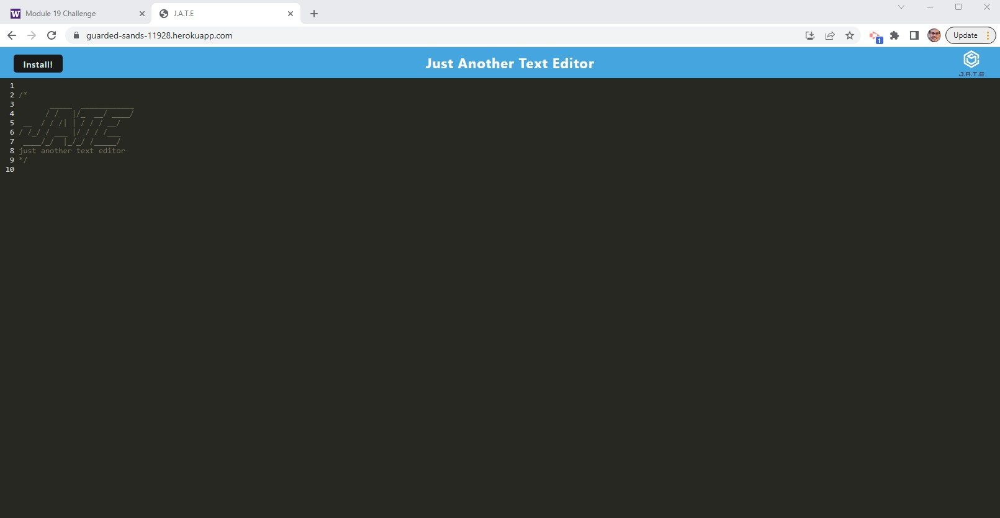

# Text Editor Starter Code 
  
  # Table of Content
  - [Description](#Description)
  - [Installation](#Installation)
  - [Usage](#Usage)
  - [License](#License)
  - [Contribution](#Contribution)
  - [Tests](#Tests)
  - [Preview](#Preview)
  - [Accreditations](#Accreditations)

   
## Description:
This application allows a user to use CRUD methods to modify text strings. The first time a user visits the Text Editor, they can download the app locally so it will work offline.  
    
## Installation:
You can find the Text Editor available online and ready to use. Just click [here](https://guarded-sands-11928.herokuapp.com/) and create your account today!
    
## Usage:
Visit the provided link and you should be presented with the application interface. From there, you can begin adding, editing, or removing text while online. If you wish to use the app offline, click install and download it locally.

## License:
Copyright 2022

Permission is hereby granted, free of charge, to any person obtaining a copy of this software and associated documentation files (the "Software"), to deal in the Software without restriction, including without limitation the rights to use, copy, modify, merge, publish, distribute, sublicense, and/or sell copies of the Software, and to permit persons to whom the Software is furnished to do so, subject to the following conditions:

The above copyright notice and this permission notice shall be included in all copies or substantial portions of the Software.

THE SOFTWARE IS PROVIDED "AS IS", WITHOUT WARRANTY OF ANY KIND, EXPRESS OR IMPLIED, INCLUDING BUT NOT LIMITED TO THE WARRANTIES OF MERCHANTABILITY, FITNESS FOR A PARTICULAR PURPOSE AND NONINFRINGEMENT. IN NO EVENT SHALL THE AUTHORS OR COPYRIGHT HOLDERS BE LIABLE FOR ANY CLAIM, DAMAGES OR OTHER LIABILITY, WHETHER IN AN ACTION OF CONTRACT, TORT OR OTHERWISE, ARISING FROM, OUT OF OR IN CONNECTION WITH THE SOFTWARE OR THE USE OR OTHER DEALINGS IN THE SOFTWARE.

[View License](https://www.mit.edu/~amini/LICENSE.md) 
    
## Contribution:
Stephen Novelli
    
## Tests:
No tests are required.
    
## Preview:

## Accreditations:
  Text Editor utilizes the npm packages babel and webpack to bundle a performant PWA for deployment and offline use. The text data and CRUD operations are hendled by indexdb and Express.js is used to build the server, with Node.js as the application framework. It is deployed for use publicly via Heroku.